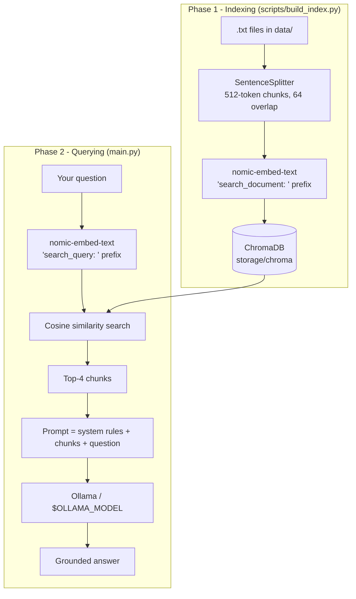

# RAGM4 — Local Retrieval-Augmented Generation on Apple Silicon

RAGM4 is a small, readable, **fully offline RAG assistant**. You drop plain-text
documents into `data/`, the project turns them into a searchable vector index,
and then you chat with a local Ollama model that answers **only from your
documents** instead of from its own memory.

Why it exists: to show the complete RAG loop — chunking, embedding, vector
search, prompt assembly, generation — in a few hundred lines of Python, with
every piece running on your own machine. No API keys, no usage billing, no data
leaving the laptop.

`main.py` also manages the model's lifecycle for you: it starts the Ollama
daemon if needed, loads the model declared in `.env` into RAM, and unloads it
again when you type `exit`.

| Layer              | Tech                                     |
| ------------------ | ---------------------------------------- |
| Orchestration      | **LlamaIndex**                           |
| LLM engine         | **Ollama** (local daemon, auto-started)  |
| Chat model         | **Any Ollama model**, set in `.env` (`OLLAMA_MODEL`) |
| Embedding model    | **nomic-embed-text** (local, `./nomic_embed`) |
| Vector database    | **ChromaDB** (persistent, `./storage/chroma`) |
| Corpus             | Plain-text essays in `./data/`           |

Everything runs on-device — no API keys, no network calls at query time.

---

## How it works

A language model only knows what was in its training data. RAG fixes that by
*retrieving* the few passages of your corpus that are most relevant to the
question and pasting them into the prompt, so the model answers from evidence
you control.

There are two phases: **indexing** (done once, offline) and **querying** (every
time you ask something).



### Phase 0 — Model lifecycle

Before any question is asked, `main.py` hands control to
[ragm4/ollama_service.py](ragm4/ollama_service.py):

1. **Read the model name** from `.env` (`OLLAMA_MODEL`). If the key is empty or
   absent, the run aborts with a message telling you to `ollama pull` a model
   and write its tag into `.env`.
2. **Serve** — if nothing answers on `http://localhost:11434`, it spawns
   `ollama serve` and waits for the daemon to accept connections. A daemon that
   was already running is reused and left alone.
3. **Check & load** — it verifies the tag exists in `ollama ls` (listing what
   you *do* have if it doesn't), then warms the model into RAM so the first
   question isn't slowed by the load.
4. **Release** — on `exit`, Ctrl-D or any error, the model is evicted
   (`keep_alive: 0`, freeing its RAM) and the daemon is stopped again if RAGM4
   is the one that started it.

### Phase 1 — Indexing

1. **Read** — [ragm4/pipeline.py](ragm4/pipeline.py) uses LlamaIndex's
   `SimpleDirectoryReader` to load every `.txt` file in `data/` into a
   `Document`.
2. **Chunk** — A `SentenceSplitter` cuts each document into ~512-token chunks
   with a 64-token overlap. Chunking matters because a whole essay will not fit
   in a prompt, and because smaller units give sharper similarity matches. The
   overlap keeps an idea from being cut in half at a chunk boundary.
3. **Embed** — [ragm4/embeddings.py](ragm4/embeddings.py) runs each chunk
   through `nomic-embed-text`, loaded from the local `nomic_embed/` folder with
   `TRANSFORMERS_OFFLINE=1` so no HuggingFace request is ever made. Token
   embeddings are mean-pooled over the attention mask and L2-normalised, giving
   one unit vector per chunk. Nomic models are trained with task prefixes, so
   passages are embedded as `"search_document: …"`.
4. **Persist** — The vectors and their source text land in a persistent ChromaDB
   collection under `storage/chroma/`. Because it lives on disk, this step runs
   once; later runs detect a non-empty collection and simply reopen it.

### Phase 2 — Querying

1. **Embed the question** with the *other* prefix, `"search_query: …"`. Using the
   matching prefix pair is what makes question vectors land near answer vectors.
2. **Search** — Chroma returns the `TOP_K` (default 4) chunks whose vectors are
   closest to the query vector. Since all vectors are normalised, the inner
   product is cosine similarity.
3. **Assemble the prompt** — LlamaIndex's query engine stuffs the retrieved
   chunks into a context block, prepends the system prompt from
   [ragm4/llm.py](ragm4/llm.py) ("answer using only the provided context; if it
   isn't there, say you don't know"), and appends your question.
4. **Generate** — [ragm4/llm.py](ragm4/llm.py) sends that prompt over HTTP to the
   local Ollama daemon (`http://localhost:11434`), which runs your `.env` model
   on the Apple Silicon GPU and returns the answer. `temperature=0.2` keeps the
   model close to the retrieved evidence, `num_predict` caps the answer length,
   `num_ctx` sets the context window and `keep_alive` keeps the weights resident
   between questions.

### Why these choices

- **Ollama instead of raw weights** — it handles the model download,
  quantisation, the chat template and Metal acceleration, and it keeps
  the model warm between questions.
- **A separate, small embedding model** — embeddings are computed for every
  chunk and every query, so speed matters far more than eloquence there.
- **A persistent vector store** — embedding the corpus is the expensive step;
  writing it to disk makes startup instant on every later run.

---

## Project layout

```
RAGM4/
├── main.py                 # interactive RAG chat REPL (auto-serves the model)
├── .env                    # your settings — OLLAMA_MODEL lives here (git-ignored)
├── .env.example            # template to copy
├── pyproject.toml
├── scripts/
│   └── build_index.py      # one-shot script to (re)build the vector index
├── ragm4/                  # the package
│   ├── config.py           # .env loading, paths, chunking, retrieval & generation params
│   ├── embeddings.py       # nomic-embed loader (with search_document/query prefixes)
│   ├── llm.py              # LlamaIndex LLM talking to the local Ollama daemon
│   ├── ollama_service.py   # start/stop the daemon, load/unload the model
│   └── pipeline.py         # read → chunk → embed → persist → retrieve
├── data/                   # raw .txt corpus
├── nomic_embed/            # HF snapshot of nomic-embed-text
└── storage/                # created at runtime — ChromaDB lives here
```

| File | Responsibility |
| ---- | -------------- |
| [main.py](main.py) | Serves the model, wires the embedding model and LLM into LlamaIndex `Settings`, opens the index, runs the REPL, then frees the model. |
| [scripts/build_index.py](scripts/build_index.py) | Offline indexing entry point (`--rebuild` to start over). Sets `Settings.llm = None`, since no generation happens while indexing — so it needs no model and no daemon. |
| [ragm4/config.py](ragm4/config.py) | Loads `.env`, exposes every tunable value and path, and `require_ollama_model()` which errors out when `OLLAMA_MODEL` is unset. |
| [ragm4/embeddings.py](ragm4/embeddings.py) | `LocalNomicEmbedding`: offline tokenizer + model, mean pooling, L2 normalisation, task prefixes. |
| [ragm4/llm.py](ragm4/llm.py) | `build_llm()`: configured Ollama client carrying the grounding system prompt. |
| [ragm4/ollama_service.py](ragm4/ollama_service.py) | `OllamaService`: context manager that starts `ollama serve`, validates + loads the model, and unloads it on exit. |
| [ragm4/pipeline.py](ragm4/pipeline.py) | `build_or_load_index()`: reuses the Chroma collection if populated, otherwise builds it. |

---

## Setup

Requires Python **3.12+** and a local [Ollama](https://ollama.com) install.

```bash
# 1. Pull a model (any model you like)
ollama pull qwen2.5:14b    # or mistral, llama3.2, neural-chat, etc.

# 2. Install the Python deps from the repo root
uv sync

# 3. Declare the model you pulled
cp .env.example .env
```

Then edit `.env` and set the tag exactly as `ollama ls` prints it:

```dotenv
OLLAMA_MODEL=qwen2.5:14b
```

You do **not** need to run `ollama serve` yourself — `main.py` starts the daemon
when it isn't already up.

### The model name is required

There is no built-in default model. If `OLLAMA_MODEL` is missing or empty,
RAGM4 exits immediately with:

```
[error] No Ollama model configured.

RAGM4 needs a chat model that is already available locally. Fix it with:
  1. Pull a model from Ollama, e.g.  ollama pull qwen2.5:14b
  2. List what you have with       ollama ls
  3. Put the exact tag in /path/to/RAGM4/.env, e.g.:
         OLLAMA_MODEL=qwen2.5:14b
```

If the tag is set but not installed, the error lists the models you actually
have, so you can copy one straight into `.env`.

### Changing model

Pull it, then change the single line in `.env`:

```bash
ollama pull mistral
# .env → OLLAMA_MODEL=mistral
uv run python main.py
```

A one-off run can still override the file from the shell, since real environment
variables take precedence over `.env`:

```bash
OLLAMA_MODEL=mistral uv run python main.py
```

---

## Usage

### 1. Build the vector index (first run only)

```bash
uv run python scripts/build_index.py
```

This reads every `.txt` file in `data/`, splits it into ~512-token chunks with
overlap, embeds every chunk with nomic-embed, and persists the vectors to
`storage/chroma/`. The step is skipped on subsequent runs. Indexing never calls
the LLM, so it works without a model or a running daemon.

To rebuild from scratch (e.g. after changing the corpus):

```bash
uv run python scripts/build_index.py --rebuild
```

### 2. Chat

```bash
uv run python main.py
```

Sample session:

```
[ollama] Starting daemon (`ollama serve`) …
[ollama] Daemon ready.
[ollama] Loading model 'qwen2.5:14b' into memory …
[ollama] Model 'qwen2.5:14b' is served and ready.
[main] Loading embedding model …
[pipeline] Reusing 41 vectors from Chroma.
============================================================
 RAGM4 — local RAG chat (Ollama · nomic-embed · Chroma)
 Model: qwen2.5:14b
============================================================
 Type your question, or 'exit' to quit.

you > What did the author do growing up?
bot > Before college the two main things I worked on, outside of school, were
writing and programming. He wrote short stories, which he describes as awful,
and started programming in 9th grade on an IBM 1401 using an early version of
Fortran …

you > exit
[ollama] Unloading 'qwen2.5:14b' to free memory …
[ollama] Memory freed.
[ollama] Stopping the daemon we started …
Goodbye. (qwen2.5:14b unloaded)
```

Type `exit` or press Ctrl-D to quit. Either way the model is evicted from RAM
before the process ends — you can confirm with `ollama ps`, which should list
nothing afterwards.

Other questions that work well on the bundled Paul Graham essay:

- `How did Y Combinator start?`
- `Why did the author leave Yahoo?`
- `What is Bel and how long did it take to write?`
- `What advice does Robert Morris give the author?`
- `Why does the author think working on unprestigious things is a good idea?`

### 3. Use your own documents

Drop any `.txt` files into `data/`, then rebuild:

```bash
uv run python scripts/build_index.py --rebuild
```

---

## Configuration

Runtime settings live in `.env`; the rest of the knobs are in
[ragm4/config.py](ragm4/config.py).

| Setting | Where | Default | Effect |
| ------- | ----- | ------- | ------ |
| `OLLAMA_MODEL` | `.env` | **required** | Any tag from `ollama ls`. No default — RAGM4 errors out if unset. |
| `OLLAMA_BASE_URL` | `.env` | `http://localhost:11434` | Daemon endpoint. |
| `OLLAMA_KEEP_ALIVE` | `.env` | `30m` | How long Ollama keeps the model in RAM between questions. Reset to `0` on exit. |
| `CHUNK_SIZE` | `config.py` | `512` | Tokens per chunk. Smaller = sharper retrieval, less context per hit. |
| `CHUNK_OVERLAP` | `config.py` | `64` | Tokens shared between neighbouring chunks, so ideas aren't cut in half. |
| `TOP_K` | `config.py` | `4` | Chunks retrieved per query. More context, slower generation. |
| `MAX_NEW_TOKENS` | `config.py` | `512` | Answer length cap (`num_predict`). |
| `TEMPERATURE` | `config.py` | `0.2` | Low values keep answers grounded in the retrieved text. |
| `OLLAMA_REQUEST_TIMEOUT` | `config.py` | `300.0` | Seconds; the first call also pays the model-load cost. |
| `CONTEXT_WINDOW` | `config.py` | `32768` | Forwarded to Ollama as `num_ctx`. |

Environment variables set in your shell override the values in `.env`.

After changing `CHUNK_SIZE`, `CHUNK_OVERLAP` or the embedding model, rebuild the
index with `--rebuild` — the stored vectors no longer match the new settings.

---

## Troubleshooting

| Symptom | Fix |
| ------- | --- |
| `No Ollama model configured` | `.env` has no `OLLAMA_MODEL`. Pull a model (`ollama pull qwen2.5:14b`) and put the tag in `.env`. |
| `Model 'X' is not installed in Ollama` | Run `ollama pull X`, or copy one of the listed tags into `.env`. |
| `The `ollama` command was not found` | Install Ollama from [ollama.com](https://ollama.com) and make sure it's on your `PATH`. |
| `` `ollama serve` exited immediately `` | Something else already owns port 11434 — that daemon will be reused; if not, stop the stray process. |
| Answers say "I don't know" | The retriever found nothing relevant: raise `TOP_K`, or check the index was built (`storage/chroma/` should be non-empty). |
| Index seems stale after editing `data/` | Rerun `scripts/build_index.py --rebuild`. |
| First answer is still slow | The model is preloaded at startup, but a large corpus + long context still takes time on the first generation. |
| RAM still used after quitting | Check `ollama ps`. RAGM4 unloads its own model; other models loaded outside RAGM4 are left alone. |

